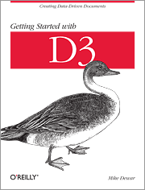

## Updated example files for the title:  
  
# Getting Started with D3, by Mike Dewar
  

  
D3.js is a powerful open source JavaScript library to deal with complex data visualization tasks. However D3.js is also famous for its steep learning curve. This repository is an updated version of the example files listed in the book above. Although it was released in June of 2012, its core concept and code idioms of `D3.js` illustrated in this book, however, had never been out of date, which makes this book an ideal starter to anyone who wants to have a taste of `D3.js`. Moreover, compared to other detailed introduction materials, this 72-page booklet will definetely save you a lot of time. Therefore I rewrote all of the examples with ES6 syntax and the latest D3.js library (`v7.0.0`) and fixed the errata and mistakes one by one to make it compatible and synchronized.

All you need to do is clone this repo and start a local server (e.g. http-server) to see the final effect in each chapter. The original version with old `D3.js` (`v2.8.0`) are named `index.html`, while the `v7.0.0` version rewritten are named `index.new.html`. 